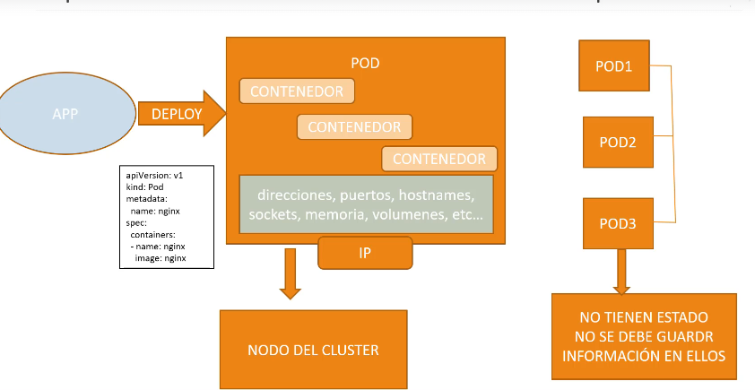
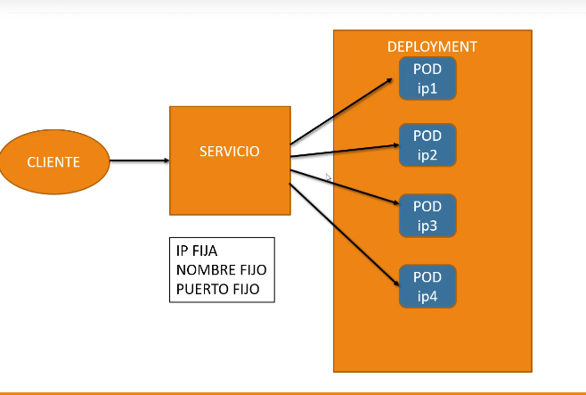

# Kubernetes

https://kubernetes.io/es/



kubectl proxy # ver servidor de kubernets apis json
http://127.0.0.1:8001/api/v1/namespaces/default/pods
http://127.0.0.1:8001/api/v1/namespaces/default/pods/nginx/proxy/

# PODS

No poner muchos contenedores de docker en un POD

```bash
kubectl run nombredepod --imag
e=httpd # es como docker correr y instala imagen
kubectl run nombredepod --image=httpd --port=8080

kubectl get pod # ver lista de pods // -o wide
kubectl describe pod nombredepod  # ver info de pod -o yaml

kubectl exec nginx -- ls # ver archivos de ese pod
kubectl exec nginx -it -- bash # entrar al bash


kubectl logs nombredepod --tail=20 # ver logs de ese pod


kubectl expose pod nombredepod --port=80 --name=nginx-svc --type=LoadBalancer
kubectl get svc
kubectl delete svc nginx-svc


kubectl port-forward nombredepod 9999:80
kubectl delete all --all # peligroso eliminar todos los pods

# labels
kubectl get pod nombredepod --show-labels # mostrar label
kubectl label pod nginx tuvieja=puta # agregar label
kubectl label pod nginx tuvieja- # eliminar
```



# DEPLOYMENT

```bash
kubectl create deployment nombredepod --image=httpd # instalar imagen  y hacer despliegue

kubectl get deployments # ver despliegues   kubectl get deploy
kubectl get replicaset # ver pods

 kubectl delete  pod nombredepod # eliminar pod, bueno reinicia pod ""


kubectl scale deploy nombreprod --replicas=5 # crear replicas , web    5/5     5            5           8m45s

```

# SERVICE

```bash
kubectl expose deploy nombre --type=ClusterIP --port=
80
kubectl get service

```
